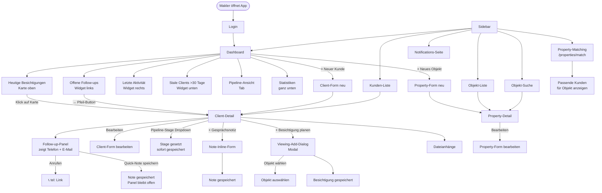

# MarklerApp — Userflow-Analyse & Verbesserungen

> Erstellt 2026-06-26 auf Basis des aktuellen Codebestands.

---

## Hauptflows (Mermaid-Diagramm)

---

## Gap-Analyse: Wo der Flow bricht

### 🔴 Kritisch — unterbricht den Arbeitsfluss täglich

**1. Kein "Call done"-Button am Follow-up-Widget**

- **Heute:** Follow-up-Zeile → Pfeil → Client-Detail öffnet sich → Follow-up-Panel erscheint → Note schreiben → speichern.
- **Problem:** 3 Klicks + Seitenwechsel für die häufigste Aktion des Tages.
- **Fix:** Direkt an der Follow-up-Zeile im Dashboard einen Mini-Button „Erledigt" → öffnet ein Inline-Popover mit Notizfeld + Outcome-Auswahl. Kein Seitenwechsel.

**2. Besichtigungs-Status kann nicht vom Dashboard aus geändert werden**

- **Heute:** Dashboard zeigt heute's Besichtigung als Karte, aber Klick öffnet nur den Kunden. Status-Änderung (COMPLETED / CANCELLED + Feedback) passiert irgendwo tief in der Client-Detail-Ansicht.
- **Problem:** Nach einer Besichtigung will der Makler sofort: Status setzen + Feedback notieren. Das dauert heute zu lang.
- **Fix:** Besichtigungs-Karte auf dem Dashboard bekommt zwei Inline-Buttons: ✓ Erledigt | ✗ Abgesagt → kleines Popover für Feedback-Note.

**3. Objekt-Detail hat keinen "Besichtigung planen"-Button**

- **Heute:** Besichtigungen können nur vom Kunden aus geplant werden.
- **Problem:** Wenn ein Makler ein Objekt anschaut und denkt "das passt zu Müller" — er muss erst Müller suchen, aufmachen, dann Besichtigung hinzufügen, dann das Objekt nochmal auswählen.
- **Fix:** Property-Detail bekommt `+ Besichtigung planen` → Dialog, Kunde auswählen (Autocomplete), Datum/Zeit, speichern.

---

### 🟡 Wichtig — verursacht Umwege

**4. Matching ist eine Sackgasse**

- **Heute:** `/properties/match` ist eine separate Seite ohne Kontext — man wählt ein Objekt und sieht Kunden. Man kommt von der Sidebar dahin, nicht aus einem Kontext.
- **Problem:** Der natürliche Trigger ist: Makler hat ein neues Objekt → will wissen, welche Kunden passen. Oder: Makler öffnet einen Kunden im ACTIVE_SEARCH-Stage → will passende Objekte sehen.
- **Fix (1):** Property-Detail bekommt Button „Passende Kunden finden" → führt zu `/properties/match?propertyId=X` mit vorausgewähltem Objekt.
- **Fix (2):** Client-Detail bei Stage `ACTIVE_SEARCH` zeigt Karte „Passende Objekte" (basierend auf Suchkriterien) als eigener Tab.

**5. Kein Pipeline-Stage-Wechsel in der Kunden-Liste**

- **Heute:** Stage nur in Client-Detail änderbar.
- **Problem:** Makler scannt morgens die Liste und will schnell 3 Kunden von PROSPECT auf ACTIVE_SEARCH setzen — macht heute 3x Seite öffnen, Dropdown klicken, zurück.
- **Fix:** Kunden-Listenzeile zeigt Stage als farbigen Badge, Klick auf Badge öffnet Mini-Dropdown inline.

**6. "Stale Clients"-Widget ohne Schnellaktion**

- **Heute:** Widget zeigt Namen + Tage, Klick → Client-Detail.
- **Problem:** Der Makler will diese Kunden kurz "abarbeiten": anrufen oder als inaktiv markieren. Heute braucht er für jeden Kunden einen Seitenwechsel.
- **Fix:** Jede Zeile bekommt zwei Icons: 📞 (tel: Link) und ⊘ (auf INACTIVE setzen). Kein Seitenwechsel für einfache Fälle.

---

### 🟢 Nice-to-have — Qualitätssteigerung

**7. Notifications-Seite ist isoliert**

- Die `/notifications`-Seite existiert, aber der Dashboard-Link zeigt nur "alle anzeigen" bei Aktivitäten. Es ist unklar was Notifications vs. Aktivitäten sind.
- **Vorschlag:** Notifications zu einer echten Inbox machen (Follow-up fällig, Besichtigung heute, Stale-Warnung) — oder ganz entfernen und ins Dashboard integrieren.

**8. Kein "Expose versenden"-Shortcut**

- Makler wollen nach einer Besichtigung oft ein Exposé nachschicken. Heute: raus aus der App, E-Mail-Client öffnen.
- **Vorschlag:** Ist bereits im PLAN.md als "E-Mail an Kunden" — priorisieren, sobald SMTP steht.

**9. Rückruf-Zeitfenster fehlt**

- Call Notes speichern Inhalt, aber kein "am besten erreichbar zwischen X und Y Uhr" am Kundenprofil.
- Viele Makler wissen: "Müller nur morgens erreichbar". Das geht heute verloren.

---

## Empfohlene Reihenfolge der Fixes

| Prio | Feature | Aufwand | Impact |
|---|---|---|---|
| 1 | Follow-up "Erledigt"-Popover direkt im Dashboard | 0,5 Tag | ⭐⭐⭐ täglich genutzt |
| 2 | Besichtigungs-Status von Dashboard-Karte aus | 0,5 Tag | ⭐⭐⭐ täglich nach jeder Besichtigung |
| 3 | Property-Detail: "Besichtigung planen" | 0,5 Tag | ⭐⭐ wöchentlich |
| 4 | Stage-Badge in Kunden-Liste clickable | 0,5 Tag | ⭐⭐ spart Klicks täglich |
| 5 | Stale-Clients: tel-Link + INACTIVE-Button inline | 0,5 Tag | ⭐⭐ wöchentliche Pflege |
| 6 | Matching-Kontext: von Property-Detail aus starten | 1 Tag | ⭐⭐ bei neuen Objekten |
| 7 | Client-Detail ACTIVE_SEARCH: "Passende Objekte"-Tab | 1 Tag | ⭐⭐ erleichtert Beratung |

---

## Gesamtbild

Der aktuelle Flow ist **datenorientiert** (Kunden, Objekte, Notizen als separate Entities) — aber ein Makler denkt **aufgabenorientiert** (was muss ich heute tun?). Die größten Gewinne entstehen, indem das Dashboard von einem reinen Anzeige-Widget zu einem echten **Aktions-Hub** wird: Follow-up erledigen, Besichtigung abhaken, Stale-Kunde anrufen — alles ohne Seitenwechsel.
