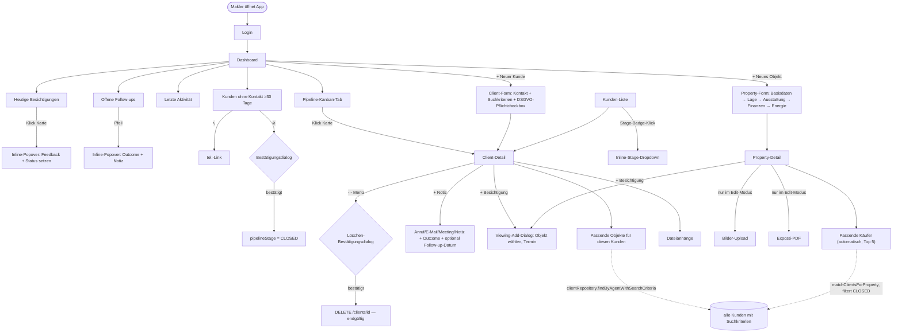

# MarklerApp — Userflow (Stand 2026-07-20)

> Faktentreue Beschreibung der aktuell implementierten Flows, auf Basis des Codes
> (`frontend/src/app/features/{dashboard,client-management,property-management,viewing-management}`,
> `backend/.../service/{ClientService,PropertyMatchingService}.java`).
> Dies ist die Grundlage für die Praxis-Review durch den `makler-praxis-check`-Agenten —
> bewusst ohne eigene Wertung, nur der Ist-Zustand.
> Ersetzt/aktualisiert `docs/USERFLOW_ANALYSIS.md` (2026-06-26); einige dort genannte Lücken
> sind inzwischen behoben (siehe Fußnote am Ende).

---

## Übersichtsdiagramm

---

## Flow 1 — Neuen Kunden anlegen

`client-form.component.ts`

1. Makler öffnet Formular (Dashboard-Button „Neuer Kunde" oder Kunden-Liste).
2. Abschnitt **Kontaktdaten**: Vor-/Nachname, E-Mail, Telefon, Adresse, `clientType` (BUYER/SELLER/TENANT/LANDLORD).
3. Abschnitt **Suchkriterien** (einklappbar, Standard: zugeklappt): Preisrahmen, Zimmer, Fläche, Lage, Ausstattungswünsche, Kauf/Miete inkl. Kalt-/Warmmiete-Unterscheidung (`clientType` steuert, welche Preisfelder angezeigt werden).
4. Abschnitt **DSGVO**: Checkbox `gdprConsentGiven`, **Pflichtfeld** (`Validators.requiredTrue`) — Formular ist ohne Haken nicht speicherbar.
5. Rechte Spalte (Context-Rail): Live-Vorschau (Initialen, Name, Ort, Typ-Badge), Sprungnavigation zu den drei Abschnitten.
6. Speichern → `POST /clients` → Redirect zu Client-Detail.

Es gibt **keine serverseitige Dubletten-Prüfung** beim Anlegen (weder E-Mail- noch Namensabgleich gegen bestehende Kunden des Agents).

---

## Flow 2 — Kunde bearbeiten / Tagesgeschäft (Client-Detail)

`client-detail.component.ts`

- **Hero-Card**: Name, Kontakt, Pipeline-Stage als Dropdown (Klick → sofortiges Speichern, kein Bestätigungsschritt).
- **⋯-Menü**: „Dokumente & Anhänge" (Modal) und „Kunde löschen" → öffnet Bestätigungsdialog (seit heute; vorher `window.confirm()`) → erst nach Klick auf „Löschen" erfolgt `DELETE /clients/{id}` (harte Löschung inkl. `PropertySearchCriteria`).
- **+ Notiz**: Modal mit Kanal (Anruf ein-/ausgehend, E-Mail, Meeting), Freitext, Outcome-Auswahl, optional Follow-up-Datum + „Follow-up nötig"-Toggle. Es gibt zusätzlich eine Voice-Note-Draft-Funktion (`VoiceNoteDraft`), die Feldwerte vorbefüllen kann.
- **+ Besichtigung**: Öffnet `ViewingAddDialogComponent` im Modus `from-client` — Objekt per Picker auswählen (Pflichtfeld), Termin. Nach dem Speichern erscheint unten rechts ein Toast „Pipeline-Stage aktualisieren?" (`showStageUpgradeHint`), der optional die Stage auf `VIEWING` setzt — Makler kann ablehnen.
- **Passende Objekte**: `PropertyMatchingService.findMatchingPropertiesForClient`, angezeigt als Liste mit Match-Score.
- **Follow-up-Panel**: separates Modal (unabhängig von der Notiz-Modal), zeigt Telefon/E-Mail direkt anwählbar.

---

## Flow 3 — Dashboard als täglicher Einstiegspunkt

`dashboard.component.ts`, Ansicht „Karten" oder „Pipeline"

| Widget | Datenquelle (Backend) | Inline-Aktion |
|---|---|---|
| Offene Follow-ups | Call-Notes mit fälligem `followUpDate` | Popover: Outcome-Buttons + Notiz → „Als erledigt speichern" |
| Heutige Besichtigungen | `ViewingService` | Popover: Feedback (Gefällt/Neutral/Nicht) + Notiz → Status `COMPLETED` |
| Kunden ohne Kontakt >30 Tage | `findActiveClientsByAgent` (schließt `CLOSED` aus), sortiert nach `updatedAt` | 📞 tel:-Link **oder** ⊘ „Als inaktiv markieren" → **Bestätigungsdialog** (seit heute) → bei Bestätigung `pipelineStage = CLOSED`, Dialog erklärt Konsequenz und wo der Kunde danach zu finden ist |
| Pipeline (Tab) | `getClientsByStage`, gruppiert nach `PROSPECT / ACTIVE_SEARCH / VIEWING / CLOSED` | Klick auf Karte → Client-Detail |
| Letzte Aktivität | kombinierter Feed aus Notes/Viewings | — |

„Als inaktiv markieren" ist **keine Löschung** — der Datensatz bleibt vollständig erhalten, verschwindet aber aus allen Ansichten, die `CLOSED`-Kunden aktiv ausblenden (Dashboard-Widgets, `findActiveClientsByAgent`). In der Kunden-Liste selbst ist er weiterhin sichtbar (Standardfilter „Alle"), im Matching für Objekte wird er seit dem heutigen Fix ebenfalls ausgeblendet.

---

## Flow 4 — Neue Immobilie anlegen & vermarkten

`property-form.component.ts` / `property-detail.component.ts`

1. Formular in Abschnitten: Basisdaten → Lage → Spezifikationen → Finanzen → Ausstattung & Energie. Alle Abschnitte einzeln auf-/zuklappbar, Fortschritt wird nicht separat angezeigt.
2. Entwurf wird automatisch im `localStorage` zwischengespeichert (Formular-Draft-Wiederherstellung beim erneuten Öffnen).
3. **Bilder-Upload** und **Exposé-PDF** sind erst im Edit-Modus verfügbar (`*ngIf="isEditMode"`) — beim Neuanlegen also nicht im selben Durchlauf möglich, sondern erst nach dem ersten Speichern.
4. Property-Detail zeigt automatisch **„Passende Käufer"** (Top 5, `matchThreshold: 0`, alle Kunden mit Suchkriterien des Agents außer `CLOSED`) direkt auf der Seite — kein Umweg über eine separate Matching-Seite nötig.
5. **+ Besichtigung** direkt vom Objekt aus möglich (`ViewingAddDialogComponent` im Modus `from-property`, Kunde wird per Picker gewählt).

---

## Matching-Mechanik im Detail

Bidirektional, aber **nicht symmetrisch implementiert**:

- **Client → Properties** (`findMatchingPropertiesForClient`, aufgerufen aus Client-Detail): matcht gegen `PropertySearchCriteria` des einen Kunden.
- **Property → Clients** (`matchClientsForProperty`, aufgerufen aus Property-Detail): lädt **alle** Kunden des Agents mit Suchkriterien (`findByAgentWithSearchCriteria`) und filtert dann in-memory nach `pipelineStage != CLOSED`, `searchCriteria != null`, passendem `clientType`/Listing-Typ und Score-Threshold.

Es gibt keine Server-seitige Deduplizierung, keine Anzeige "bereits kontaktiert für dieses Objekt" im Matching-Ergebnis, und keine Rückmeldung, wenn ein Kunde in mehreren offenen Matches gleichzeitig auftaucht.

---

## Bekannte, im Code bestätigte Datenpunkte, die (noch) fehlen

- Kein Feld für bevorzugte Erreichbarkeit / Rückrufzeitfenster am Kunden (`Client.java` hat kein entsprechendes Attribut).
- Duplikatsprüfung beim Kundenanlegen existiert, aber nur über die E-Mail-Adresse (`ClientService.createClient`, `existsByAgentAndEmail`) — und nur, wenn ein E-Mail-Feld überhaupt ausgefüllt wurde (`Client-Form` macht E-Mail nicht zur Pflicht). Ein zweiter Kontakt mit gleichem Namen, anderer/leerer E-Mail wird nicht erkannt.
- Pipeline hat vier Stages (`PROSPECT, ACTIVE_SEARCH, VIEWING, CLOSED`) — `CLOSED` deckt sowohl „erfolgreich abgeschlossen" als auch „nicht mehr aktiv/verloren" ab, es gibt keine Unterscheidung.

---

### Fußnote: Stand ggü. `docs/USERFLOW_ANALYSIS.md` (2026-06-26)

Bereits behoben seit der alten Analyse: Follow-up-Inline-Popover (Gap 1), Besichtigungs-Status-Inline-Popover (Gap 2), „Besichtigung planen" von Property-Detail aus (Gap 3), Stage-Badge inline editierbar in der Kunden-Liste (Gap 5), Stale-Clients-Widget mit Tel-Link + Inaktiv-Button (Gap 6, jetzt zusätzlich mit Bestätigungsdialog). Weiterhin offen: Matching-Einstiegspunkt für `ACTIVE_SEARCH`-Kunden als eigener Tab (Gap 4 Fix 2), Notifications-Seiten-Klarheit (Gap 7), Exposé-Versand-Shortcut (Gap 8), Rückruf-Zeitfenster (Gap 9).
